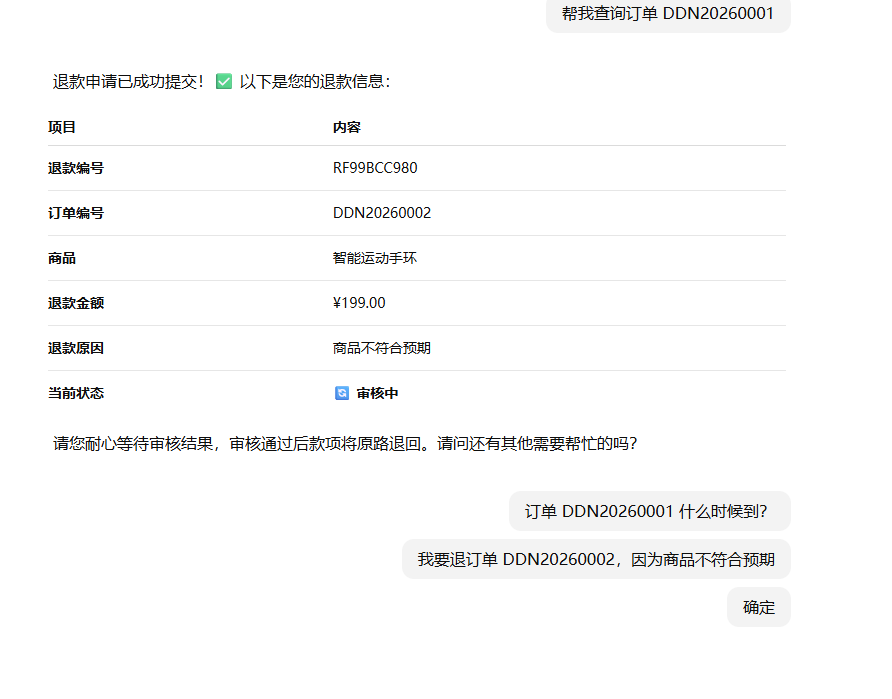
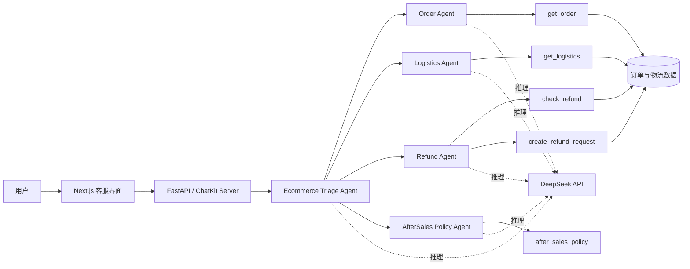
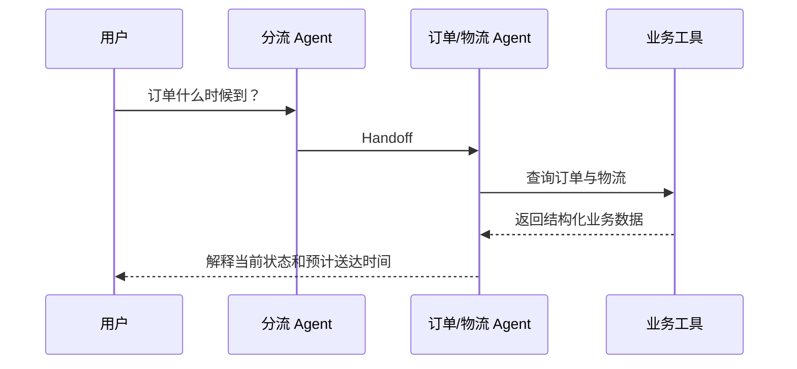

# 电商售后智能客服 Agent

一个面向电商售后场景的多智能体客服系统。用户可以通过自然语言查询订单和物流、了解售后政策、检查退款条件并提交退款申请。

系统使用分流 Agent 识别用户意图，再将任务交给订单、物流、退款或售后政策 Agent。各 Agent 通过工具调用访问业务数据，不依赖模型编造订单结果；退款等高风险操作必须经过用户明确确认。

## 功能特性

- 自动识别订单、物流、退款和售后政策意图
- 多 Agent Handoff 与上下文连续传递
- 查询订单商品、金额、支付状态和订单状态
- 查询快递公司、运单号、物流轨迹和预计送达时间
- 检查订单退款资格
- 退款提交前二次确认
- 创建退款申请并返回申请编号
- 售后政策问答
- 本地安全 Guardrail
- Agent、工具调用、上下文和运行事件可视化
- DeepSeek 模型接入
- 前后端分离与流式响应

## 运行效果

退款 Agent 会先检查订单资格，等待用户明确确认后才允许创建退款申请。



## 系统架构



## Agent 设计

| Agent | 负责内容 | 可用能力 |
| --- | --- | --- |
| Ecommerce Triage Agent | 识别用户意图，将请求转给专业 Agent | Agent Handoff |
| Order Agent | 查询订单、商品、金额、支付和订单状态 | `get_order` |
| Logistics Agent | 查询快递、运单、轨迹和预计送达时间 | `get_logistics` |
| Refund Agent | 检查退款资格并提交退款申请 | `check_refund`、`create_refund_request` |
| AfterSales Policy Agent | 回答退换货、运费和到账时间问题 | `after_sales_policy` |

专业 Agent 之间也可以继续 Handoff。例如，订单查询完成后，用户继续询问到货时间，系统可以切换到物流 Agent，而不需要重新开始会话。

## 核心流程

### 订单与物流查询



### 退款确认

退款操作采用两阶段安全流程：

1. `check_refund` 查询订单并检查是否满足退款条件。
2. Agent 向用户展示退款信息并要求明确确认。
3. 用户确认前，`create_refund_request` 的 `confirmed` 必须为 `false`。
4. 用户明确确认后，工具才允许创建退款申请。
5. 系统返回退款申请编号和审核状态。

即使模型错误调用退款工具，只要没有传入明确确认状态，业务服务仍会返回 `confirmation_required`，不会执行退款。

## 安全设计

### 输入 Guardrail

本地规则会拦截常见危险输入，例如：

- 要求泄露系统提示词
- 要求忽略原有规则
- 要求绕过退款确认
- 数据库破坏指令

Guardrail 使用本地规则执行，正常请求不会额外消耗模型 Token。

### 业务层保护

- 模型只能通过受控工具访问订单数据
- 工具返回统一的结构化结果
- 不存在的订单不会由模型补全
- 退款资格检查与退款创建相互分离
- 高风险写操作必须明确确认
- 每个会话维护独立业务上下文

## 技术栈

### 后端

- Python 3.12
- FastAPI
- OpenAI Agents SDK
- OpenAI ChatKit Server
- DeepSeek API
- Pydantic
- Server-Sent Events
- Pytest

### 前端

- Next.js 15
- React 19
- TypeScript
- Tailwind CSS
- OpenAI ChatKit

## 项目结构

```text
.
├── python-backend/
│   ├── ecommerce/
│   │   ├── agents.py        # Agent、Handoff 与任务指令
│   │   ├── context.py       # 会话业务上下文
│   │   ├── demo_data.py     # 本地订单、物流和退款数据
│   │   ├── guardrails.py    # 输入安全规则
│   │   ├── model_config.py  # DeepSeek 模型配置
│   │   ├── services.py      # 订单、物流与退款业务逻辑
│   │   └── tools.py         # Agent Function Tools
│   ├── tests/
│   ├── main.py              # FastAPI 入口
│   ├── server.py            # ChatKit、Runner 与会话事件
│   └── memory_store.py      # 本地线程存储
├── ui/
│   ├── app/                 # Next.js 页面与样式
│   ├── components/          # 对话、Agent、事件和 Guardrail 面板
│   └── lib/                 # API 与类型定义
└── docs/
```

## 本地运行

### 1. 配置后端环境

```powershell
cd python-backend
python -m venv .venv
.\.venv\Scripts\Activate.ps1
pip install -r requirements.txt
Copy-Item .env.example .env
```

编辑 `.env`：

```env
DEEPSEEK_API_KEY=你的DeepSeek_API_Key
DEEPSEEK_BASE_URL=https://api.deepseek.com
DEEPSEEK_MODEL=deepseek-chat
OPENAI_TRACING_DISABLED=1
```

真实 API Key 不应提交到 Git。

### 2. 启动后端

```powershell
cd python-backend
.\.venv\Scripts\python.exe -m uvicorn main:app --reload --port 8000
```

健康检查：

```text
http://localhost:8000/health
```

### 3. 启动前端

新建一个终端：

```powershell
cd ui
npm install
npm run dev:next
```

访问：

```text
http://localhost:3000
```

## 测试数据

| 订单号 | 商品 | 状态 | 推荐测试 |
| --- | --- | --- | --- |
| `DDN20260001` | 无线蓝牙耳机 Pro | 运输中 | 订单和物流查询 |
| `DDN20260002` | 智能运动手环 | 已签收 | 完整退款流程 |
| `DDN20260003` | 机械键盘 K87 | 已关闭 | 不可退款场景 |

推荐对话：

```text
帮我查询订单 DDN20260001
订单 DDN20260001 什么时候到？
我要退订单 DDN20260002，因为商品不符合预期
我确认退款，请提交
七天无理由退货的运费由谁承担？
```

## 自动化测试

```powershell
cd python-backend
.\.venv\Scripts\python.exe -m pytest -q
```

测试覆盖：

- 正常订单查询
- 不存在订单查询
- 物流信息查询
- 退款资格检查
- 未确认退款拦截
- 确认后创建退款申请

## 当前边界

- 订单、物流和退款数据目前为本地模拟数据
- 会话与退款记录尚未持久化到数据库
- 售后政策使用内置规则回答
- 当前主要用于本地运行、功能演示和 Agent 工程实践

## 后续计划

- [ ] 接入 MySQL 或 PostgreSQL
- [ ] 使用 RAG 管理售后政策与商品知识
- [ ] 增加登录、用户身份与订单归属校验
- [ ] 增加人工客服转接
- [ ] 增加 Redis 会话缓存与异步任务
- [ ] 增加模型、Handoff 和工具调用评测
- [ ] 增加超时、重试、限流和日志追踪
- [ ] 使用 Docker Compose 完成部署

## License

本项目使用 [MIT License](LICENSE)。
