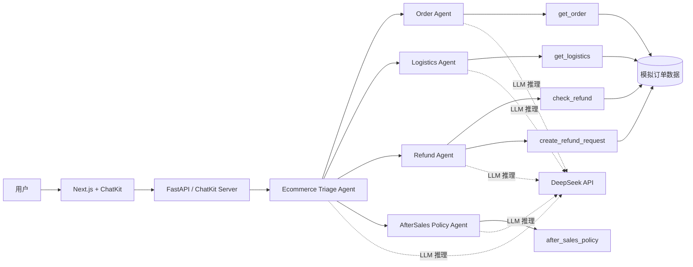

# 电商售后智能客服 Agent

基于 OpenAI Agents SDK 与 DeepSeek 开发的多智能体电商售后客服系统。系统可以识别用户意图，将订单、物流、退款和售后政策问题转交给对应的专业 Agent，并通过工具调用查询或更新业务数据。

> 本项目基于 OpenAI 官方开源项目 `openai-cs-agents-demo` 进行二次开发，保留原项目 MIT License 与上游来源。

## 项目功能

- 多 Agent 意图识别与自动分流
- 订单信息查询
- 快递状态、物流轨迹和预计送达时间查询
- 退款资格检查
- 退款操作二次确认
- 退款申请创建与状态返回
- 售后政策问答
- Agent handoff、工具调用和上下文变化可视化
- DeepSeek API 接入
- 本地安全规则 Guardrail

## 系统架构



## Agent 职责

| Agent | 职责 | 主要工具 |
| --- | --- | --- |
| Ecommerce Triage Agent | 识别意图并转交专业 Agent | Handoff |
| Order Agent | 查询商品、金额、支付和订单状态 | `get_order` |
| Logistics Agent | 查询运单、物流轨迹和预计送达时间 | `get_logistics` |
| Refund Agent | 检查退款资格并创建退款申请 | `check_refund`、`create_refund_request` |
| AfterSales Policy Agent | 回答退换货、运费和到账时间问题 | `after_sales_policy` |

## 退款安全设计

退款属于高风险操作，系统采用两阶段流程：

1. 调用 `check_refund` 检查订单是否满足退款条件。
2. 要求用户明确确认退款。
3. 只有确认后，才允许调用 `create_refund_request(..., confirmed=true)`。

未确认时，工具只返回 `confirmation_required`，不会创建退款记录。

## 技术栈

### 后端

- Python 3.12
- FastAPI
- OpenAI Agents SDK
- OpenAI ChatKit Server
- DeepSeek API
- Pydantic
- Pytest

### 前端

- Next.js 15
- React 19
- TypeScript
- Tailwind CSS
- OpenAI ChatKit

## 项目结构

```text
.
├── python-backend/
│   ├── ecommerce/
│   │   ├── agents.py          # Agent 定义与 handoff
│   │   ├── context.py         # 会话上下文
│   │   ├── demo_data.py       # 模拟订单和物流数据
│   │   ├── guardrails.py      # 本地安全规则
│   │   ├── model_config.py    # DeepSeek 模型配置
│   │   ├── services.py        # 可离线测试的业务服务
│   │   └── tools.py           # Agent 工具
│   ├── tests/
│   │   └── test_ecommerce_services.py
│   ├── main.py
│   └── server.py
├── ui/
│   ├── app/
│   └── components/
└── docs/
    └── DEVELOPMENT_PLAN_CN.md
```

## 本地运行

### 1. 配置 DeepSeek

进入 `python-backend`，复制环境变量模板：

```powershell
Copy-Item .env.example .env
```

编辑 `.env`：

```env
DEEPSEEK_API_KEY=你的DeepSeek_API_Key
DEEPSEEK_BASE_URL=https://api.deepseek.com
DEEPSEEK_MODEL=deepseek-chat
OPENAI_TRACING_DISABLED=1
```

`.env` 已加入 `.gitignore`，不要将真实 Key 提交到仓库。

### 2. 启动后端

```powershell
cd python-backend
python -m venv .venv
.\.venv\Scripts\Activate.ps1
pip install -r requirements.txt
python -m uvicorn main:app --reload --port 8000
```

### 3. 启动前端

新开一个终端：

```powershell
cd ui
npm install
npm run dev:next
```

访问：`http://localhost:3000`

## 测试数据

| 订单号 | 商品 | 状态 | 适合测试 |
| --- | --- | --- | --- |
| `DDN20260001` | 无线蓝牙耳机 Pro | 运输中 | 订单、物流查询 |
| `DDN20260002` | 智能运动手环 | 已签收 | 退款完整流程 |
| `DDN20260003` | 机械键盘 K87 | 已关闭 | 不可退款场景 |

推荐测试对话：

```text
帮我查询订单 DDN20260001
订单 DDN20260001 什么时候到？
我要退订单 DDN20260002，因为商品不符合预期
我确认退款，请提交
```

## 自动化测试

```powershell
cd python-backend
.\.venv\Scripts\python.exe -m pytest -q
```

当前覆盖：

- 正常订单查询
- 不存在订单查询
- 物流查询
- 未确认退款拦截
- 确认后创建退款申请

## 后续计划

- [ ] 使用 MySQL 持久化订单、物流和退款记录
- [ ] 使用 RAG 构建售后政策知识库
- [ ] 增加人工客服转接
- [ ] 增加用户身份与订单归属校验
- [ ] 增加日志、超时和失败重试
- [ ] 使用 Docker Compose 完成多服务部署
- [ ] 增加 Agent 路由和工具调用评测

## License

本项目遵循 [MIT License](LICENSE)。
